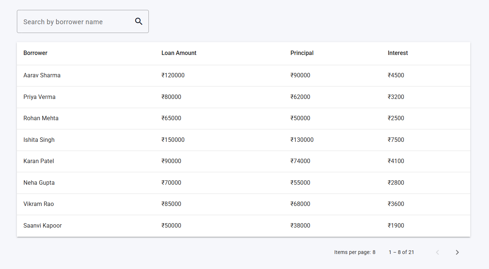

# Loan Management Dashboard

A small Angular application simulating a loan management dashboard with:

- Loan list screen (search + pagination)
- Loan detail screen (summary + repayment history)
- 'Add Repayment' modal with reactive forms
- Mock API using an in-memory service + RxJS

---

## Tech Stack

- **Angular**: 17.x
- **Node**: 20.x
- **Framework**: Angular CLI, TypeScript
- **UI**: Angular Material (MDC)
- **State & async**: RxJS, BehaviorSubject, Observables
- **Styling**: SCSS

---

## Features

### Loan List Screen

- Displays each loan with:
  - Borrower name
  - Loan amount
  - Outstanding principal
  - Outstanding interest
- Search by **borrower first name**:
  - Case-insensitive
  - Matches names starting with the entered text (`A` → Aarav, Aditya, Ayush, etc.)
- Client-side pagination (Material `MatPaginator`)
- Clickable rows:
  - Clicking a row navigates to the **Loan Detail** screen for that loan

---

### Loan Detail Screen

- Shows a **summary card** for the selected loan:
  - Borrower Name
  - Loan Amount
  - Outstanding Principal
  - Outstanding Interest
- A **Repayment History** table:
  - Columns: Amount, Date, Running Balance
  - Shows how the total outstanding reduces after each repayment
- **“\< Back”** button:
  - Navigates back to the loan list
  - Preserves the last visited page index via query params

---

### Add Repayment Modal

- Implemented using Angular Material `MatDialog`
- Uses **Reactive Forms**:
  - `amount` (required, `> 0`, numeric only)
  - `date` (required, cannot be in the future)
- Validation:
  - Amount must be a positive number
  - Date must be today or earlier
- On submit:
  - Simulates an API call (via RxJS `delay`)
  - Adds a new repayment entry
  - Updates **running balance**, **outstanding principal**, and **outstanding interest**
  - UI updates immediately without page reload

**Repayment logic:**

1. Repayment always reduces **outstanding interest first**
2. Any remaining amount reduces **outstanding principal**
3. Running balance is calculated as:

    First repayment: principal + interest – amount

    Next repayments: last runningBalance – amount

---

# How to Run
### Clone Repo - git clone https://github.com/ayush1428/Loan-Management-Mini-Dashboard.git

### cd Loan-Management-Mini-Dashboard

### Install dependencies - npm install

### Run application - ng serve 

